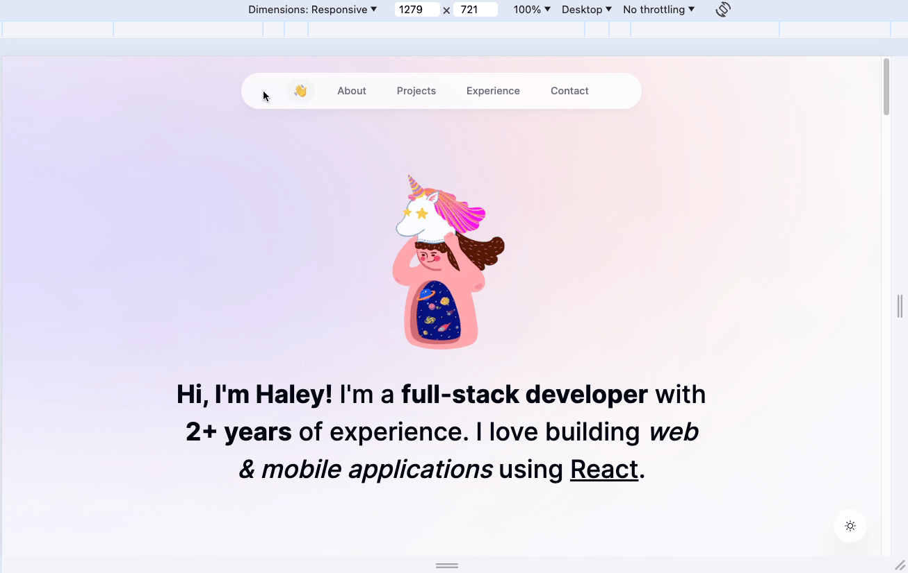

# 🦄 Haley's Portfolio


[](https://github.com/emazzotta/lighthouse-badges)
[](https://github.com/emazzotta/lighthouse-badges)
[](https://github.com/emazzotta/lighthouse-badges)
[](https://github.com/emazzotta/lighthouse-badges)

Welcome to my Portfolio repository! This repository contains the source code for my personal portfolio website, showcasing my projects, skills, and journey as a software engineer.

This is a [Next.js](https://nextjs.org/) project bootstrapped with [`create-next-app`](https://github.com/vercel/next.js/tree/canary/packages/create-next-app).

## Live Demo

You can view the live demo of the portfolio website [here](https://www.haleyjung.xyz).



## Features

- **Responsive Design**
  - Fesigned to be fully responsive, ensuring optimal viewing experience across various devices and screen sizes.
- **Dynamic Content**
  - Dynamic content sections such as project showcases, skills, and experiences, making it easy to navigate and explore.
- **Interactive Elements**
  - Interactive elements such as animations, transitions, and hover effects are incorporated to enhance user engagement and visual appeal.
- **Accessibility**
  - Accessibility features are implemented to ensure that the website is usable by individuals with disabilities, adhering to web accessibility standards.
- **SEO Optimization**
  - Optimized for search engines, with proper meta tags, headings, and structured data markup to improve visibility and ranking.

## Tech Stack

<div style="display: flex; flex-wrap: wrap;">
    
    
    
    
    
</div>

## Installation and Usage

To run the portfolio website locally, follow these steps:

1. Clone the repository:
    ```bash
    git clone https://github.com/haleyjung/hj-portfolio.git
    ```

2. Install dependencies:
    ```bash
    cd hj-portfolio
    npm install
    ```

3. Start the development server:
    ```bash
    npm run dev
    ```

4. Open your browser and navigate to http://localhost:3000 to view the website.

## Contributing

Contributions to the portfolio website are welcome! If you find any bugs, issues, or have suggestions for improvements, please feel free to open an issue or submit a pull request.
